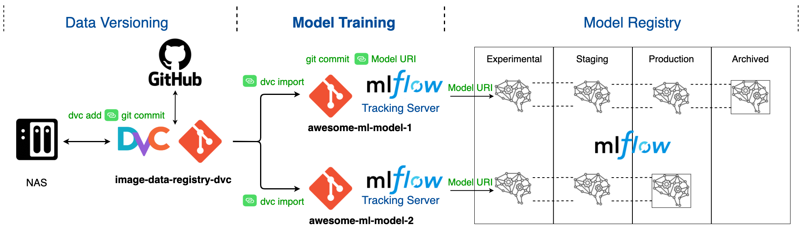
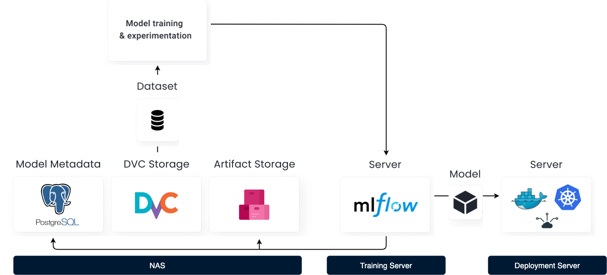

# Awesome ML Model

## Table of Contents
- [Introduction](#introduction)
  * [Project Infrastructure](#project-infrastructure)
  * [Prerequisites](#prerequisites)
  * [Installation & Configuration](#installation---configuration)
- [Model Training](#model-training)
  * [Add a new processed dataset](#add-a-new-processed-dataset)
  * [Update processed dataset](#update-processed-dataset)
    

## Introduction
This project contains an example of how to use a [DVC data registry](https://github.com/marcopaspuel/image-data-registry-dvc) to import training data.

The graph bellow shows the complete model life cycle. We will use a **NAS**, **DVC**, and **Git** to build a data version system.
Then we wil use **DVC**, **Git** and **MLflow** for model tracking. Finally we will use **MLflow** to build a model registry. 
- The first part **Data Versioning** is covered in the [this repository](https://github.com/marcopaspuel/image-data-registry-dvc).
- The second part **Model Training** is covered in [current repository](https://github.com/marcopaspuel/awesome-ml-model).
- The third section **Model Registry** is covered in [this repository]().



### Project Infrastructure
The graph bellow shows the infrastructure of the project when running on a local server (not cloud).



### Prerequisites
- [Poetry](https://python-poetry.org/docs/#installation) 
- [Python >=3.8](https://www.python.org/doc/)

### Installation & Configuration

To initialize the project run the following command:
```bash
poetry install
```

Initialize DVC with the following command:

```bash
poetry run dvc init
```

Then we need to configure the remote storage.

```bash
poetry run dvc remote add -d storage /Users/marco/Documents/image_data_registry_dvc_storage
```

## Model Training

### Add a new processed dataset

Import the processed day image data into the training data subdirectory:

```bash
poetry run dvc import https://github.com/marcopaspuel/image-data-registry-dvc \
                      processed/01_image_dataset/data/outputs/day_images \
                      -o data/training
```

Import the processed night image into the training data subdirectory:

```bash
poetry run dvc import https://github.com/marcopaspuel/image-data-registry-dvc \
                      processed/01_image_dataset/data/outputs/night_images \
                      -o data/training
```

### Update processed dataset

First, create a new branch:

```bash
git checkout -b update-processed-dataset
```

Then update the datasets with the following commands:

```bash
poetry run dvc update data/training/day_images.dvc
```

```bash
poetry run dvc update data/training/night_images.dvc
```

Commit and push.

```bash
git push
poetry run dvc push
```

Finally, you can open a PR and merge.
